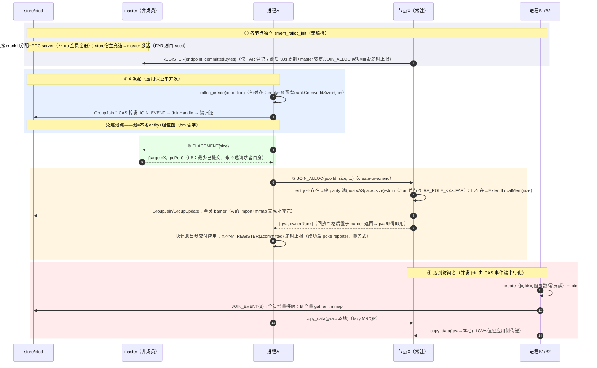
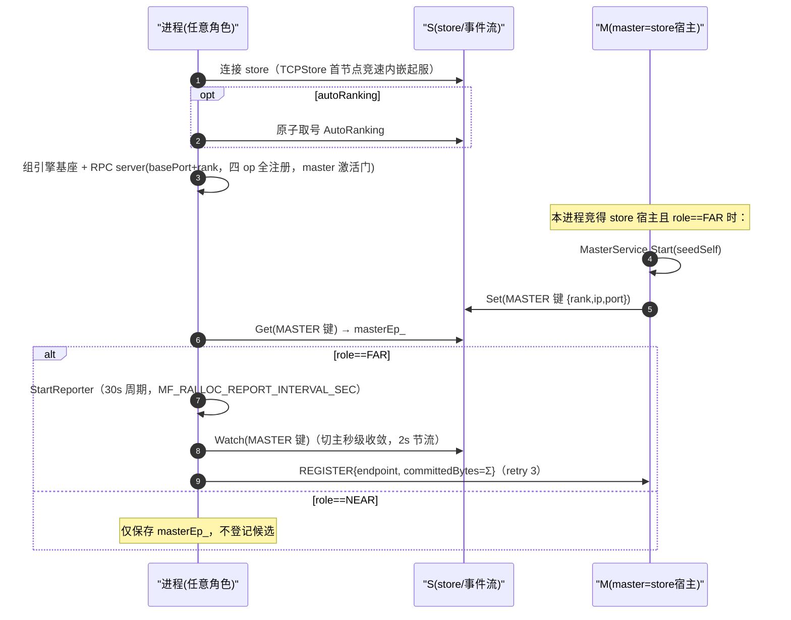
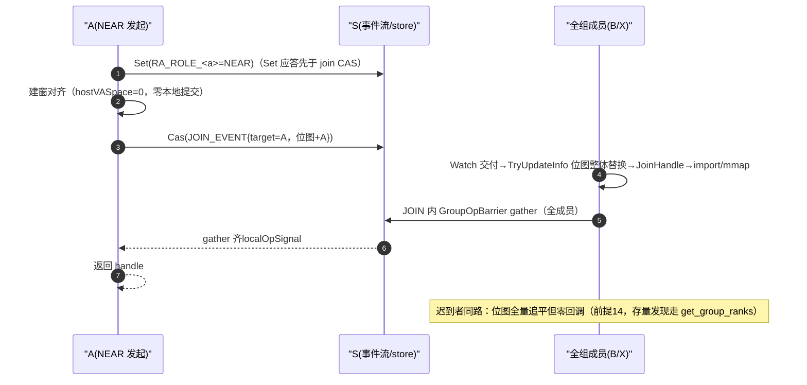
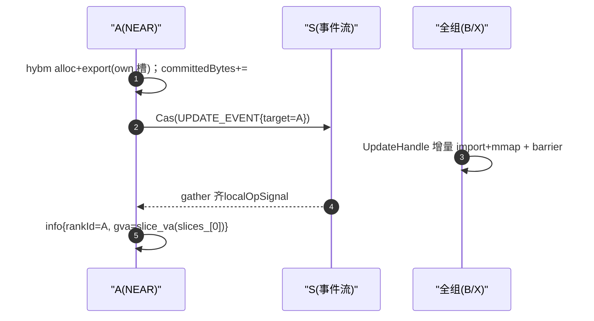
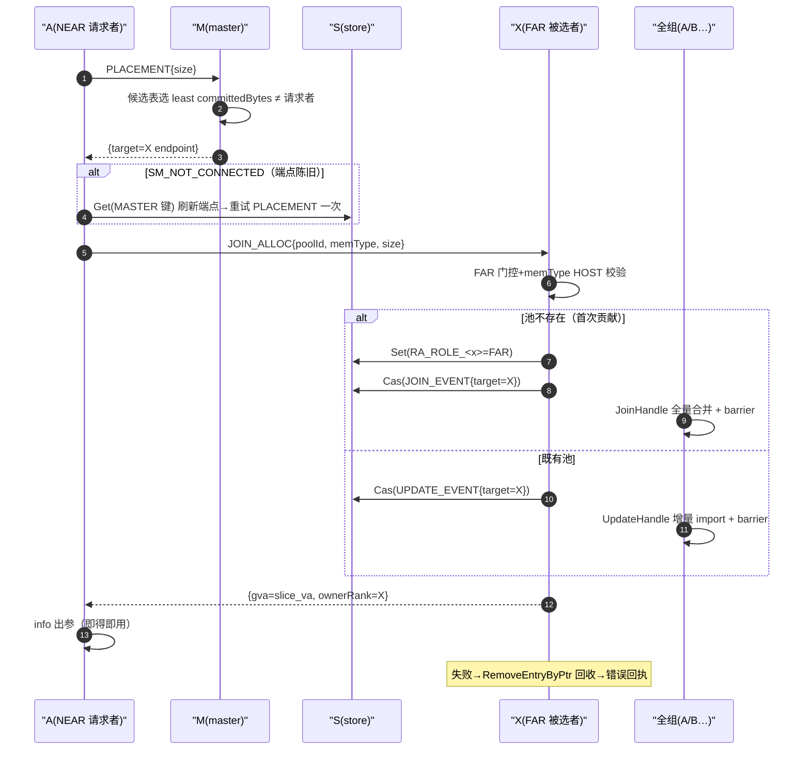
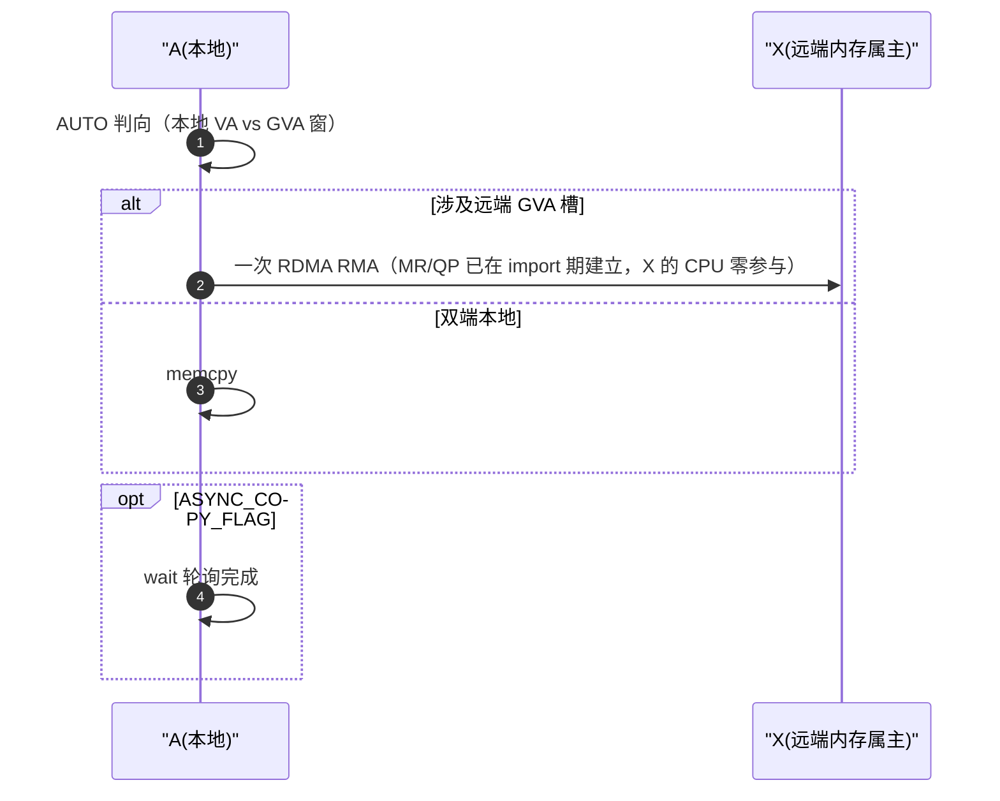
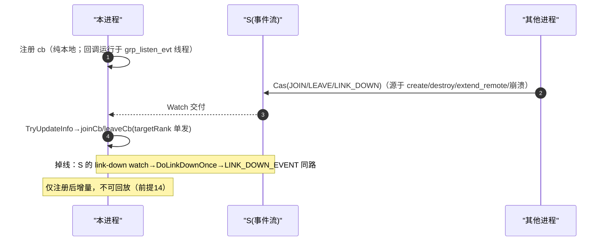
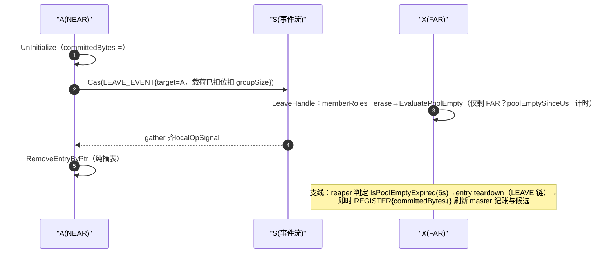
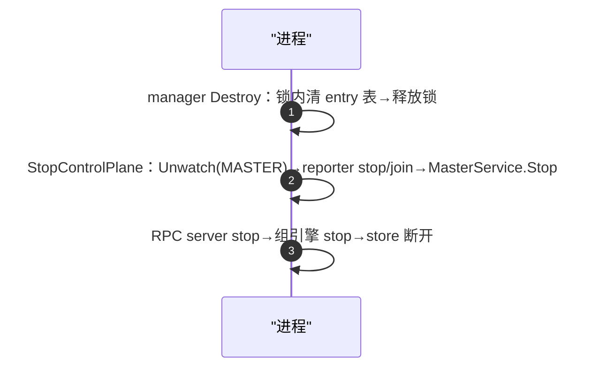
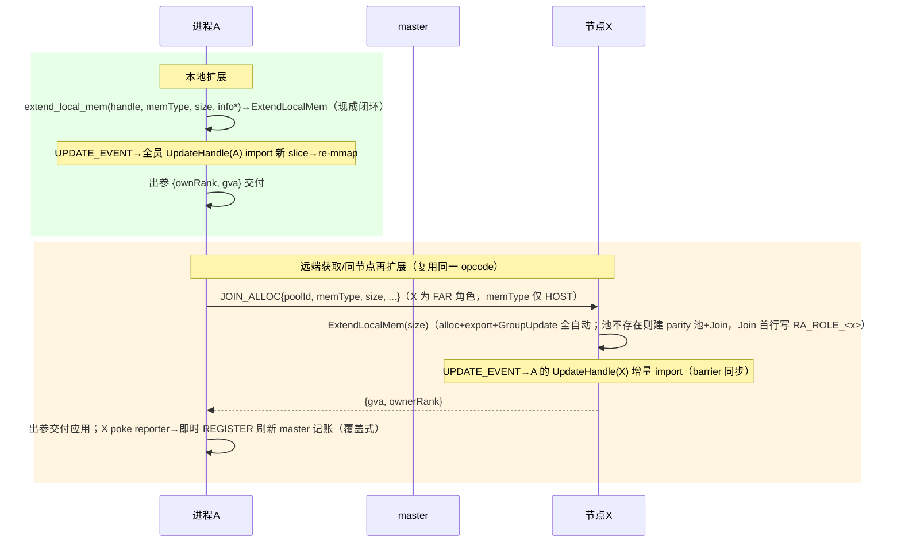

# smem_ralloc 设计文档

> 定位：`src/smem` 下第四个平级入口（与 smem_bm / smem_shm / smem_trans 同型同构），**allocation-native 远端内存获取**；
> hybm 引擎仅新增只读区间查询接口（`hybm_query_alloc_ranges`），核心语义零改动；本文档为后续开发需求跟踪基线（需求清单见第 7 节）。

---

## 1. 目标使用模型

```
NEAR 节点 A 调用 ralloc_create（纯对齐：建窗+join，零本地提交）──► extend_remote_mem ──► master 选点
──► FAR 节点 X 贡献内存并 Join ──► 出参 {rankId, gva} 交付 ──► 所有已入组成员（A/B）可直接 copy 访问
支持扩展：NEAR 本地 extend_local_mem / 远端 extend_remote_mem（复用同一 JOIN_ALLOC 闭环）
```

- 无 malloc/free 子分配：**一次获取动作 = 一块内存 = 一个 hybm slice**，统一经 `smem_ralloc_mem_info{rankId, gva}` 出参交付
- **create 纯对齐（B' 裁剪）**：本地零提交、无出参；本地提交入口 = extend_local（NEAR 自己槽）/ JOIN_ALLOC（FAR 被动）
- **库不做块/extent 记账**：应用自持块清单；任意 rank 的当前有效 extent 由 `get_mem_size_by_rank`（hybm 查询+窗内折叠）动态获知
- **entry 生命周期**：NEAR entry = 应用 destroy 显式管理；FAR entry（executor 属有）= 组空自毁（见 §6.5）
- v1 应用保证：首个 create 单并发（内含 join）；仅近端共享访问；B 后续可随时加入

## 2. 节点角色（config.role，默认 FAR）与能力矩阵

| 角色 | create | extend_local | extend_remote | copy/wait/查询/事件 | 登记候选/接受 JOIN_ALLOC |
|---|---|---|---|---|---|
| NEAR | ✅（唯一 handle 途径） | ✅（本地槽提交，不进 master 记账） | ✅ | ✅ | ❌/❌ |
| FAR | ❌（SM_NOT_SUPPORTED） | —（无 handle） | —（无 handle） | —（纯内存供给节点） | ✅/✅ |

- master = store 竞速胜者**激活**（handler 全员注册，见 §4），角色任意：NEAR 可自请求（永不选中自己）；FAR 自 seed 进候选表
- **FAR 的 entry 只能来自 executor（JOIN_ALLOC）**——"FAR entry ⟺ 内部属有"由构造保证，无需属主标记
- 角色经池前缀 store 键 `RA_ROLE_<rank>`（join 前写入）传播，供组空自毁判定（见 §6.5）
- 场景对应：A/B=NEAR，X=FAR；master 可兼任任意角色

## 3. API 面（C，对齐 smem_bm.h 风格）

| API | 说明 |
|---|---|
| `smem_ralloc_init(storeURL, worldSize, deviceId, config)` | 单函数进程初始化（对齐 `smem_bm_init`）：store 连接 + rankId 分配 + 组引擎基座 + RPC server 启动 + store 宿主竞速注册 master（照抄 RacingForStoreServer 模式） |
| `smem_ralloc_create(id, option) → handle` | 纯对齐：建窗+join 融合（bm create2 流程），零本地提交、无出参；仅 NEAR 可调（FAR→SM_NOT_SUPPORTED）；失败路径回收 entry |
| `smem_ralloc_destroy(handle)` | entry 生命周期结束，本地内存全释放 |
| `smem_ralloc_copy(handle, src, dst, size, flags)` | 直包 hybm data op（AUTO 方向） |
| `smem_ralloc_extend_local_mem(handle, memType, size) → info` | 本地槽扩展一块（bm extend_local_mem 同形+出参；alloc+export+GroupUpdate 闭环；memType 为 HBM 预留） |
| `smem_ralloc_extend_remote_mem(handle, memType, size) → info` | 远端获取一块：PLACEMENT → JOIN_ALLOC（create-or-extend）→ {ownerRank, gva} 出参；memType 与 extend_local 对称（当前仅 HOST） |
| `smem_ralloc_get_mem_size_by_rank(handle, rank, memType)` | 动态 extent 查询：hybm_query_alloc_ranges 指定介质窗折叠（memType 默认 HOST 向后兼容；替代 get_local_mem_size_by_mem_type） |
| `smem_ralloc_get_mem_ptr_by_rank(handle, rank, memType)` | 指定介质窗的槽基址，与上行同族命名（get_mem_*_by_rank），配对得有效区间 [ptr, ptr+size)，memType 默认 HOST |
| `smem_ralloc_get_group_ranks(handle, rankIds, maxCount)` | 组成员快照枚举（含自身，引擎位图 GetMemberRanks 单次快照）：事件流单槽不可回放（前提 14），注册回调前的存量成员（含迟到 B 视角全员）由此发现；满容量按 worldSize 分配，返回实际数（>maxCount=截断可检测），UINT32_MAX=失败；配 get_mem_size_by_rank 区分"在组无提交"成员 |
| `smem_ralloc_wait(handle)` / `get_rank_id()` / `set_group_event_handler(handle, cb, ctx)` | bm 同形 |
| `smem_ralloc_register_user_mem(handle, addr, size)` / `smem_ralloc_unregister_user_mem(handle, addr)` | 用户本地内存注册（bm 同形）：`hybm_register_local_memory`/`hybm_free_local_memory` 直包，entry 幂等记账（registedSlice_，destroy 自动注销）；纯本地操作，不涉 master/RPC；按地址区间分流 HBM/DRAM，DEVICE_RDMA 池的 DRAM buffer 须 4K 对齐 |

约束：`maxDramSize`/`maxHbmSize`/各 extend size 均 2M 对齐（hybm 大页约束，SMEM_RALLOC_SIZE_ALIGNMENT）；
mem_type 枚举镜像 bm 取值（HOST/DEVICE，见 §11）；双介质池两窗任选其一大于 0 即建对应窗，两窗全 0 拒绝；
**SDMA 位 + DRAM 窗的组合受 GVA_V4 门槛约束**（见 §11.7），device 形态池用 HBM-only 窗。

rankId：**三角色统一由 init 分配**（`autoRanking` 从 store 原子取号 / config 显式，
参考 smem_bm_entry_manager.cpp:64-67 / :115-133），组位图去重兜底（smem_net_group_engine.cpp:1291-1295）。

## 4. 通信面

| 项 | 设计 |
|---|---|
| RPC | acc_links（acc_tcp）封装，进程级单例 server + 帧内 poolId 复用（对齐 hcom 进程单例模式） |
| opcode | `REGISTER{endpoint,committedBytes}`（覆盖式记账）/ `PLACEMENT{size}→{target}` / `JOIN_ALLOC{poolId,memType,size,...}→{gva,ownerRank}`（create-or-extend 二合一）/ `PING` |
| handler 注册 | **四 op 全员注册**于 RpcService::Start（防切主后无 handler）；REGISTER/PLACEMENT 仅 master 激活时服务（IsRunning 门，未激活回 SM_NOT_STARTED），PING 恒应答 |
| 端口 | basePort + rankId，错开 store 8572 / hcom 10005 / net 9980 |
| master 候选表 | 内存表：`{rankId → endpoint, committedBytes}`；**覆盖式记账**：FAR 上报权威值（Σ entry 提交量），30s 周期 `MF_RALLOC_REPORT_INTERVAL_SEC` + 三类事件即时触发（master 变更 watch poke / JOIN_ALLOC 成功 poke / 组空自毁后），无乐观累加 |
| TLS | 复用 acc_tcp_ssl_helper，与 store 开关对齐 |

## 5. 主链路时序



### 5.1 逐 API 多进程交互时序

**约定**：`A`=NEAR 发起者，`B`=NEAR 迟到者，`X`=FAR 贡献者，`M`=master（store 宿主），`S`=配置中心
（承载单槽事件流 `SMEM_GROUP_LISTEN_EVENT_KEY`、MASTER 键、RA_ROLE_ 键）。事件流每条记录 =
**全量位图+curEvent+targetRank**，单槽 CAS，消费即覆盖。可见性契约：JOIN/UPDATE 内 barrier 为
全成员 gather ⇒ **发起接口返回 ⇒ 全员 import/mmap 完毕**（gva 即得即用）。

**图 1：`config_init` / `get_rank_id` / `get_mem_size_by_rank` / `get_mem_ptr_by_rank` / `get_group_ranks`
—— 零跨进程交互**。均为本地查询：rankId init 时定格；extent=本地 hybm 区间折叠；ptr=窗基址算术；
组成员=引擎位图快照。数据新鲜度 = 本地事件流应用点（eventual consistency）。

**图 2：`smem_ralloc_init`（FAR 视角；NEAR 走 else 分支）**



**图 3：`smem_ralloc_create`**



**图 4：`smem_ralloc_extend_local_mem`**



**图 5：`smem_ralloc_extend_remote_mem`**



**图 6：`smem_ralloc_copy` / `smem_ralloc_wait`**



**图 7：`smem_ralloc_set_group_event_handler`**



**图 8：`smem_ralloc_destroy`**



注：**用户侧 destroy 无即时 REGISTER**（RemoveEntryByPtr 纯摘表，smem_ralloc_entry_manager.cpp:225-247），
记账新鲜度靠 FAR 周期上报兜底；仅 FAR 自毁路径（reaper，:515-518）有即时上报——NEAR 发起方本就无记账，语义自洽。

**图 9：`smem_ralloc_uninit`**



## 6. 扩展场景

**机制基座（现成闭环，smem_bm_entry.cpp:390-429）**：`ExtendLocalMem` = alloc 新 slice → export →
`GroupUpdate`（UPDATE_EVENT）→ 全员 `UpdateHandle` 增量 import 最新 slice → re-mmap，失败自动回滚。
**块↔slice 天然 1:1，无需区间切分，亦无需库内记账**。



**可见性契约（重要）**：JOIN/UPDATE 事件内的 GroupOpBarrier 是全成员 gather——发起者返回即所有成员
import+mmap 完毕；executor 回执严格后置于 barrier 返回，因此**获取接口返回后 gva 即查即用**，无需等待环。
`get_mem_size_by_rank` 为当前导入快照（并发中的第三方扩展按 eventual consistency 呈现）。

### 6.5 FAR entry 组空自毁

```
每个 entry 维护 memberRoles_（rank→角色）：
  · join 前节点在池前缀 store 写 RA_ROLE_<rank>（写先于 join 事件 CAS，次序安全）
  · JoinHandle(rk)：读键入表 + 清自毁标记；自身 join 成功时经 GetMemberRanks() 种子化全表
  · LeaveHandle(rk)（LINK_DOWN 与 LEAVE 共口）：出表后评估
判定（仅 FAR entry）：其余在组成员角色全为 FAR（含"无其余成员"）→ 记 poolEmptySinceUs_
reaper（manager 周期线程，FAR 节点）：FAR entry 且标记超过宽限（默认 5s，MF_RALLOC_POOL_GRACE_SEC）
  → UnInitialize(含 GroupLeave) + RemoveEntryByPtr + 即时上报 master
```

- **多 FAR 同池**（A 两块分置 X1/X2）：A 离开后 {X1,X2} 互见为 FAR → 对称触发、双双回收（事件 CAS 串行化+宽限兜底）
- B 仍在则不触发（NEAR 在表）；B 走后才触发；A 崩溃经 LinkDown 与主动 destroy 同路
- 角色键读不到时 fail-safe 按 NEAR 处理（宁漏不误杀）；宽限期内新 NEAR 加入即清标记
- FAR 禁 create ⇒ FAR entry 必为 executor 属有 ⇒ 应用 handle 永不被自毁误杀（无属主标记需求）
- NEAR 的 extend_local 不进 master 记账（候选表只统计 FAR entry 的提交量）

## 7. 需求跟踪清单

| ID | 需求 | 承载机制 | 新增/复用 | 期次 | 状态 |
|---|---|---|---|---|---|
| R1 | 进程初始化（store/rankId/RPC server/master 竞速） | `smem_ralloc_init` | 新增（薄） | P1 | 已交付（RPC server/master 竞速随 R3/R4） |
| R2 | A 发起池创建（本地构建+join 融合） | create2 式构建+GroupJoin/JoinHandle | 复用 | P1 | 已交付（P2 裁剪为 `(id, option)` 纯对齐：零本地提交/无出参/仅 NEAR；失败路径回收 entry） |
| R3 | master 选点（PLACEMENT+LB+候选表） | acc_tcp | 新增 | P1 | 已交付（P2 升级：仅 FAR 登记候选；覆盖式记账=周期+三类事件即时上报（master 变更/JOIN_ALLOC/自毁）；handler 全员注册+master 激活分离；**FAR watch MASTER 键**——master 变更秒级重注册（2s 节流），报告/PLACEMENT 失败自愈刷新端点） |
| R4 | 目标节点被动贡献（JOIN_ALLOC create-or-extend） | join 事件机 | 复用+薄执行器 | P1 | 已交付（X 建 parity 池+Join 或既有池 ExtendLocalMem，失败回滚 entry；gva 取 slices_[0] 的 slice_va——修正 P1 窗基址 bug） |
| R5 | 动态 extent 查询 | hybm_query_alloc_ranges 增量 API+窗内折叠 | 新增（只读查询） | P1.5 | 已交付（`get_mem_size_by_rank`；region 记账模型已废弃，见 §10） |
| R6 | GVA 访问 | copy_data+lazy MR/QP | 复用 | P1 | 已交付（AUTO 方向 copy/wait，随 R2） |
| R7 | 本地扩展 | `extend_local_mem` 闭环 | 复用+薄封装 | P1.5 | 已交付（`extend_local_mem(handle, memType, size, info*)`，bm 同形+出参） |
| R8 | 远端同节点扩展 | ~~REMOTE_EXTEND opcode~~ | 并入 R4 | — | 已消解（JOIN_ALLOC create-or-extend 二合一，无需独立 opcode） |
| R9 | B 迟到访问 | create(0)+join 融合；extent 经 `get_mem_size_by_rank` 免费获知 | 复用 | P1.5 | 已交付（内存可见性消解；应用层仅剩对象布局元数据需自行同步；**存量成员发现缺口**经代码级验证——单槽事件流不可回放，见前提 14——由 `get_group_ranks` 补齐） |
| R10 | HBM 介质放开 | ralloc option `maxHbmSize`；extend_* memType 路由；RPC 消息 v2（maxHbmSize/deviceCommittedBytes）；master 双桶 LB（§11） | 新增 | P3 | 已交付（03 device 变体 E2E 5/5：HBM-only 池 + SDMA\|DEVICE_RDMA + extend_local/remote(DEVICE) + copy 往返 + wait；A2/910C-V3 环境约束与出路见 §11.7） |
| R11 | zbal 适配评估 | — | — | P3 | 待启动 |
| R12 | 故障场景（X 掉线/重连、master 降级/切主自动重竞速、LinkDown 时延打磨；hybm allocatedSize_ 失败不回滚） | LeaveHandle/LinkDown 机制 | 复用+打磨 | P3 | 待启动（handler 全员化+**watch 触发即时重注册**已消解切主 30s 收敛窗；FAR 周期 REGISTER 天然重建候选表；切主检测/重竞速本身仍待做） |
| R13 | FAR entry 生命周期闭环（组空自毁） | 角色键 RA_ROLE_+memberRoles_+reaper | 新增 | P2 | 已交付（§6.5；宽限 5s/env；FAR 禁 create 免属主标记） |
| R14 | 用户本地内存注册（bm 对齐） | `smem_ralloc_register_user_mem`/`unregister_user_mem`：entry 幂等记账 registedSlice_，destroy 自动注销；纯本地不涉 master/RPC | 新增（薄） | P3 | 已落码待重编验证（python：register/unregister；DRAM 主场景，DEVICE_RDMA 池 DRAM buffer 须 4K 对齐） |

## 8. 已代码验证的设计前提

1. groupSize 动态（构造起 0，随 join±1）→ A+X 两人起步合法（smem_net_group_engine.h:99-107，
   smem_net_group_engine.cpp:1198/:1168）
2. CAS 事件键串行化一切成员变更；GroupJoin 的 BUSY=没抢到键而非等人（smem_net_group_engine.cpp:1271-1337）
3. 迟到加入=JOIN_EVENT→JoinHandle 全量合并（smem_bm_entry.cpp:167-258）；
   extend 发布=UPDATE_EVENT→UpdateHandle 增量 import（:260-306, :390-429）
4. Join 超时默认 60s（`MF_GROUP_JOIN_MAX_TIMEOUT`，smem_types.h:64），barrier 错误全员传播
   （smem_net_group_engine.cpp:124-179）
5. create2 纯本地免互斥；全局状态变更收敛于 join 事件机（smem_bm_entry.cpp:27-113）
6. rankId init 内分配（autoRanking，smem_bm_entry_manager.cpp:115-133）；
   master=RacingForStoreServer 竞速（:98-113）
7. 传输层进程单例（HcomTransportManager/hcom driver/端口）→ RPC server 对齐此模式
8. hybm 层仅新增只读查询接口（`HybmVaManager::QueryAllocRanges` / `hybm_query_alloc_ranges`，
   含 `BM_BUFFER_TOO_SMALL` 容量语义），核心引擎与既有 API 零改动；smem_bm/smem_shm/smem_trans 零侵入
9. JOIN/UPDATE 事件内的 GroupOpBarrier 为全成员 gather（smem_net_group_engine.cpp:124-179）：
   发起者返回 ⇒ 全员 import+mmap 完毕 ⇒ 获取接口出参 gva 即得即用（无需等待环）
10. hostGva_ 为窗基址（rank0 槽基址，smem_bm.cpp:390-417 算术证实）；own 槽内地址 = 窗基址+ownRank×maxDRAMSize，
    首块 gva 必须取 `hybm_get_slice_va(slices_[0])` 而非窗基址（P1 曾误用，P1.5 已修正）
11. leave 事件应用先于回调：提交方 ClearBitmapForRank 已在事件载荷内扣位扣 groupSize（:1408-1409/:1061-1062），
    接收方 TryUpdateInfo 整体替换 groupInfo_ 后才调 leaveCb（:901-902→:1021-1024）——LeaveHandle 时点
    GetMemberRanks()/GetRankSize() 已扣除离开者；LINK_DOWN 与 LEAVE 共用 leaveCb（崩溃/主动 destroy 同路）
12. 引擎新增公有只读 GetMemberRanks()（shared_lock 走位图，纯增量方法），bm/trans 零影响
13. Destroy 与 reporter 锁序：Destroy 在持锁作用域内清 entry 表后**先释放锁再 join reporter**——reporter 的
    上报/回收路径也取 entry 锁，锁序一致无死环
14. **事件流单槽不可回放**：全组共用 `SMEM_GROUP_LISTEN_EVENT_KEY` 单槽 CAS（消费即被下一条覆盖，
    TryCleanOldEvent 还会主动清理）；初始 Watch 交付仅最新一条记录——TryUpdateInfo（:808-822）整体替换
    groupInfo_（全量位图瞬间追平）但 JoinLeaveEventProcess 仅按 curEvent 单 target 分派（:982）、
    NULL/STOP 直接返回零回调（:1032-1034）、未 joined_ 者跳过他人 JOIN（:975）⇒ **状态可追平、事件不可
    回放**；注册回调前的存量成员（含迟到 B 视角全员）只能经 `get_group_ranks` 枚举发现（bm 同引擎同缺口，
    记备注不动 bm 代码）

## 9. 文件布局

```
src/smem/csrc/smem_ralloc/
  smem_ralloc.cpp                    # C API（init/create/extend/查询/copy）
  smem_ralloc_entry.{h,cpp}          # 编排（三件套模式，无记账）
  smem_ralloc_entry_manager.{h,cpp}
  smem_ralloc_rpc.{h,cpp}            # acc_tcp 封装（REGISTER/PLACEMENT/JOIN_ALLOC/PING）
  smem_ralloc_master.{h,cpp}         # 候选表+LB+计数
  smem_ralloc_executor.{h,cpp}       # X 侧被动执行器（JOIN_ALLOC create-or-extend）
include/host/smem_ralloc.h           # 公共头
CMake/BUILD 挂载（python 绑定暂未提供，需要时参照 bm wrapper 添加）
src/hybm/
  hybm_def.h / hybm_big_mem.h / hybm_big_mem_entry.cpp / mm/hybm_va_manager.{h,cpp}   # 增量：区间查询
```

## 10. 作废设计存档

| 作废项 | 原因 |
|---|---|
| store 建池键 + first-caller-wins | 应用保证首个 create 单并发 |
| 隐式建池 / B 懒 attach 自动化 | 同上；B 用显式 create(0) 即可 |
| malloc/free + RbtreeRangePool 子分配 | 块↔slice 1:1，无需切分 |
| master 零贡献入组 | 改纯服务，免除 barrier 义务 |
| rankId 动态分配（JOIN_ALLOC 携带） | 统一 init 内分配（bm 一致） |
| galloc 经 bm 公开 API 消费（方案 A） | 升级为第四独立入口（方案 B） |
| **region 记账表**（region_info/AddRegion/QueryRegion/regionId） | 库不记账：获取动作统一 `smem_ralloc_mem_info{rankId,gva}` 出参交付，应用自持块清单 |
| **create 的 policy 枚举**（NONE/LOCAL/REMOTE_AUTO/REMOTE） | create 只管本地构建+join；远端获取独立为 extend_remote_mem，语义正交 |
| **store 发布 per-rank extent** | 动态查询数据源改走 hybm VaManager（订阅路径自动喂入，无需新增同步通道） |
| **`get_local_mem_size_by_mem_type` 静态镜像** | 远端获取场景本 rank 返回 0，bm 惯用配对（查自己=查所有人）失效；换 `get_mem_size_by_rank` 动态值 |
| **extend_remote 的 preferRank 参数** | P1.5 砍除：master LB 唯一路径；后续需要时加参即向前兼容 |
| **extend_remote 返回前的等待环**（轮询 import 追平） | barrier 同步已保证回执时点全员 import 完毕，等待环为死代码 |
| **create 的 localDRAMSize/出参 info**（B' 裁剪） | 角色模型下本地提交需求=该节点应为 FAR（FAR 无 handle）；create 退化为纯对齐，出参恒 {INVALID,null} 无存在价值 |
| **entry 属主标记（appOwned/executorOwned）** | FAR 禁 create 后"FAR entry ⟺ executor 属有"由构造保证，角色即属主 |
| **槽字节数推导贡献者**（GetMemSizeByRank>0 ⟺ FAR） | 会被 extend_local（NEAR 本地提交）污染；改显式角色键 RA_ROLE_ |
| **master 乐观记账**（PLACEMENT 时 committedBytes += size） | 覆盖式权威上报取代：计数漂移/destroy 虚高/切主候选表重建三问题一并消解 |
| **handler 仅 master 注册** | 四 op 全员注册+IsRunning 激活门：切主后 handler 不缺位，PING 对任意节点可探活 |


## 11. HBM 双介质支持（v10）

### 11.1 模型（对齐 hybm/bm 一池双介质）

- create(max_dram_size, max_hbm_size)：两窗任选，>0 即预留该介质窗（双开即双介质池）；两窗全 0 → 拒绝（对齐 bm "maxMemorySize is 0"）
- extend_local/remote(mem_type, size)：**单次调用单介质**，块落入该介质的 rank 槽；DEVICE 且池无 HBM 窗 → SM_NOT_SUPPORTED
- GVA 布局双窗并列：host 窗 hostGva_ + rank×maxDRAMSize，device 窗 deviceGva_ + rank×maxHBMSize，各窗基址进程间一致（bm GetPeerDevicePtr 同构）
- **op 位与介质解耦**（对齐 bm，无介质-op 交叉校验）：错配（HBM 窗 + 全 host 位）走 hybm 运行时自然失败；非 NPU 构建下 SDMA/DEVICE_RDMA 位仍被编译守卫拒绝（create 与 executor 两处）

### 11.2 RPC 消息 v2（128B → 144B，msgVersion=2）

| 新增字段 | 用途 |
|---|---|
| uint64 maxHbmSize | JOIN_ALLOC：FAR 建池时预留 HBM 窗 |
| uint64 deviceCommittedBytes | REGISTER：DEVICE 介质 committed 记账（size 语义收窄为 HOST committed） |

### 11.3 分介质 LB 记账

- REGISTER 双桶：Candidate{committedBytes(host), deviceCommittedBytes}，覆盖式权威上报（ reporter/PokeReporter 三触发不变）
- PLACEMENT 按请求介质取对应桶选 least-loaded，仍永不选 requester

### 11.4 分层落点

| 层 | 变更 |
|---|---|
| entry | deviceGva_ 成员；Initialize 双窗口（HBM>0 预留 device 窗，提交仍延迟到 extend，与 host 窗对称）；committedBytes_/deviceCommittedBytes_ 分桶；ExtendLocalMem 按 memType 路由 alloc/export；GetMemPtr/SizeByRank(rank, memType)、GetRankIdByGva 先判属窗、AddrInHostGva/AddrInDeviceGva |
| executor | JOIN_ALLOC 校验按介质分支（maxHbm/maxDram、LOCAL_HBM/DRAM_SIZE_MAX）；create 分支 TransHybmMemType(maxDram,maxHbm) + 初始 size 按 memType 路由 deviceVASpace/hostVASpace；extend 分支透传 msg.memType |
| master | Candidate 双桶 + OnPlacement 按介质选点（§11.3） |
| create | maxHbmSize 接线、TransHybmMemType、56 位阈值改 (dram+hbm)×rankCount（对齐 bm） |
| 公开 API | smem_ralloc_get_mem_size/ptr_by_rank 增 memType 参数（默认 HOST 向后兼容） |
| python | 同名 mem_type 参数（默认 HOST）；RallocDataOpType 开 py::arithmetic() 支持 SDMA \| DEVICE_RDMA 位组合 |
| 用例 | 03/04 参数化 [host|device]：device 变体 data_op_type=SDMA\|DEVICE_RDMA + copy 后 handle.wait()（SDMA 异步收敛，HOST 路径无 wait） |

### 11.5 验证矩阵与状态

- P1（TCP 集群，编译级）：全量重编（msg v2）→ 03/04 host 路径全绿（双拓扑）——**已通过**（回归基线）
- P2（NPU+CANN）：03 device 变体 E2E——**已通过**（2026-09，单机双进程 NEAR+FAR，5/5：HBM-only 池创建 /
  extend_local(DEVICE) 首块 gva=0x280080000000 / extend_remote(DEVICE) 跨进程贡献（PLACEMENT 双桶选点 +
  JOIN_ALLOC device 分支）/ copy 往返（SDMA 优先链）+ wait 收敛）。原四项待验证随之覆盖：
  ① device 窗"只预留不提交"✅ ② hybm_query_alloc_ranges 对 device 窗可用✅ ③ DataCopy AUTO 对 device GVA
  介质识别✅ ④ device 窗基址跨进程一致✅（FAR 侧贡献块被 NEAR 按窗内偏移正确寻址）
- 遗留待验证：① 04 device 双节点（跨机 HBM 贡献 + SDMA/DEVICE_RDMA 数据面）；② R14 register/unregister
  重编后按探针脚本验证；③ 910C+hdk≥25.5.0（GVA_V4）上双介质池（DRAM 窗+SDMA 位）复验，解锁 §11.7 约束

### 11.6 假设与边界（v1）

- FAR 节点同构假设：不做 per-node HBM 容量过滤（后续按介质容量/余量扩展）
- 一池双介质窗均全 rank 织造（与 host 窗同构）；非 NPU 构建下 HBM 池在 hybm device alloc 处自然报错（无 create 前置门，对齐 bm）

### 11.7 DRAM×SDMA 互斥约束 = GVA_V4 门槛（机理，实测修订）

hybm InitDramSegment（hybm_entity_default.cpp:1140）在 SDMA 位置位时要求 DRAM 段 CheckSdmaReaches 为真。
段分派（hybm_mem_segment.cpp:85-94）**不是按 SoC 而是按 GVA version**：`GVA_V4 && 910C && shmFd<0` 才走
VmmBased，否则一律 ConnBased。实测：910C 机器 + hdk24.x 驱动（Innerversion V100R001C21SPC010B220，判为
GVA_V3）**同样命中 ConnBased → 同一行报错**——约束的真界限是驱动代际，不是芯片。

**版本判定链**：`HalGvaPrecheck`（hybm_gva_version.cpp:175）读 `/etc/ascend_install.info` 的
`Driver_Install_Path_Param=` → `<path>/driver/version.info` 的 `Innerversion=`，逐级比对：

| GVA | 阈值（Innerversion） | HDK | HAL 符号组 |
|---|---|---|---|
| V3 | V100R001C21B035 | hdk24.x | devmm_*/svm_*（legacy SVM） |
| **V4** | **V100R001C23SPC005B219** | **hdk25.5.0** | halMem*（VMM 统一编址） |
| V5 | V100R001C10B001（归 V4 处理） | hdk26.0.0 | halMem* |

SoC 识别独立于驱动：`AclrtGetSocName`（dl_acl_api.cpp:130，"Ascend910_93"→910C，static 缓存）。
比 V4 旧的驱动会**静默降级**（V3 匹配即 init 成功），只有 SDMA+DRAM 组合在实体初始化时 fail-fast 暴露。

段类型与注册语义（CheckSdmaReaches 分派）：

| 段类型 | 条件 | CheckSdmaReaches | 根因 |
|---|---|---|---|
| HybmConnBasedSegment | 非 V4+910C（含 910B、910C+V3 驱动） | 恒 false（基类默认） | 连接式模型：远端 DRAM 仅 mmap 进本进程 VA，数据走 hcom host 传输；段内无 serverId/superPodId 设备坐标，SDMA 设备引擎无设备侧地址/MR 可用 |
| HybmVmmBasedSegment | GVA_V4 + 910C | 恒 true | 统一编址：host DRAM 进入设备可编址 GVA 空间，SDMA 天然可达 |
| HybmDevLegacySegment（HBM） | — | 按 importMap_ 拓扑判定（同 server/同 superpod，910B 再限同 CONN 组） | HBM 有真实设备坐标 |

推论：**GVA_V4 门槛以下的任何环境**"DRAM 窗 + SDMA 位"物理不可实现（fail-fast）；双介质池携带 SDMA 位须
hdk≥25.5.0（V4）。device 变体用例（03/04）因此预留 **HBM-only 窗**（max_dram=0），在 V3 驱动上走
DevLegacy HBM 段 + SDMA（legacy 路径，实测通过，见 §11.5）。

### 11.8 hybm 分配/注册机制速查（维护参考）

**HAL 两代接口**（libascend_hal.so，随 HDK 驱动安装，按 GVA version 互斥 dlsym 加载，dl_hal_api.cpp:80-111）：
V1-V3 = devmm_*/svm_*（legacy SVM，设备 VA 预留+物理页映射）；V4/V5 = halMem*（VMM 统一编址，host DRAM
也进设备编址）。HDK 版本 ↔ GVA 映射见 §11.7。兄弟库：libascendcl（CANN 计算运行时，AclrtGetSocName）。

**分配接口 × 段类型**（"谁分配"决定"要不要注册"）：

| 介质/段 | 分配接口 | 说明 |
|---|---|---|
| HBM / DevLegacy（V1-V3） | GvaReserveMemory 预留 SVM VA + drv::HalGvaAlloc 映射 HBM 大页 | 分配即设备 VA |
| HBM / VmmBased（V4/950） | HalMemCreate{MEM_DEV_SIDE, MEM_HBM_TYPE} | 分配即统一编址 |
| DRAM / ConnBased（非 V4+910C） | **OS mmap** MAP_FIXED（hugepage→4K 降级链；56 位 GVA 边角才试 halMemAlloc，V3 下符号未加载必败） | 物理页是 OS 的，VA 钉在窗口 slot；HAL 不参与分配 |
| DRAM / VmmBased（V4+910C） | HalMemCreate{MEM_HOST_SIDE, P2P_DDR}（1G 大页→2M 降级） | 分配即统一编址，无独立注册步骤 |

**注册矩阵**（HAL=halHostRegister 拿 DVA；MR=RaRegisterMR 拿 lkey/rkey）：

| op × 介质 | HAL 注册 | MR 注册 |
|---|---|---|
| SDMA × HBM | 不需要（分配即 DVA） | 不需要 |
| SDMA × DRAM | V3：组合被拒（§11.7）；V4：不需要 | 不需要 |
| DEVICE_RDMA × HBM | 不需要 | **需要**（DVA 原样注册；发 WR 无 key 直接报 lAddr not register） |
| DEVICE_RDMA × DRAM | V3：**需要** halHostRegister(HOST_MEM_MAP_DEV)；V4：不需要 | V3：indirect 模式 skip per-region MR（swap 中转）；V4：需要（HVA→DVA 转换后注册） |

**copy 选路**：GetPrioritedDataOperators 固定优先链 SDMA→DEVICE_RDMA→HOST_RDMA→HOST_URMA→HOST_TCP→
HOST_SHM，逐个试错降级（首个 BM_OK 胜出，失败打 WARN "data copy ... with data op X failed"）。建池时
InitTagManager 把 op 位展开为同 tag 规则，rank 对 op 集 = 池声明位集。

**register_user_mem 链路**（R14）：hybm_register_local_memory → RegisterLocalMemory（bm 场景优先
dramSegment_，entity:242-246）→ RegisterMemCommon 按地址区间分流（HBM 区间纯 VaManager 登记；host 地址
含 DEVICE_RDMA 位才 halHostRegister）。MR 随后注册（isHbm ? HBM : DRAM flag）。纯本地，不影响组视图。
